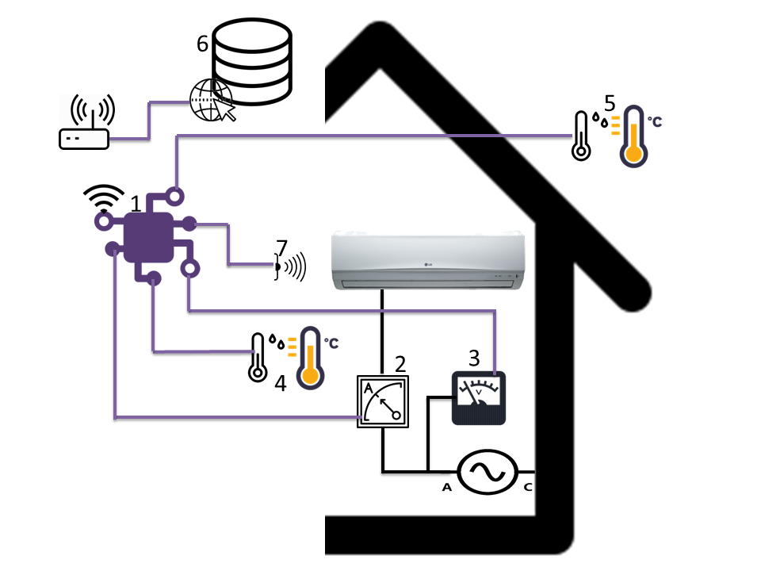

# HAVAC_Control

The present work carries out the implementation of two classic control techniques: Linear and PI, which include the external temperature as a variable of the control loop. The control system designed here is applied to a mini-split type AC system, to verify the energy consumption when applying these control techniques.

In this repository you will find the code for the Arduino Mega 2560 board, which achieves the aforementioned goal.

The steps carried out to calculate and implement the work were:

### 1. Development of control techniques

With the information obtained from the previous phase, it was determined that the hardware and software platform to be used is Arduino, and three steps were determined for the development of control techniques:

#### 1.1. Monitoring development
The sensors were chosen according to the variables identified in the literature review. The following libraries were used for monitoring programming: EmonLib (OpenEnergyMonitor, n.d.-a) for monitoring electrical variables, and DHTLib for monitoring environmental variables (Adafruit, n.d.-b).

#### 1.2. Implementation of monitoring
The monitoring of the variables of interest was implemented and the incidence of the external temperature in the behavior of the AC was determined before the implementation of the control.

#### 1.3. Linear Regression Analysis
With the information obtained from the initial monitoring, a Simple Linear Regression (SRL) model was applied through Excel, which correlated the incidence of the external temperature in the internal temperature of the enclosure when the AC is in operation. This regression analysis determined how external temperature is related to AC behavior.

#### 1.4. Control development and implementation
After the previous step, the control techniques were developed and implemented: Linear and the PI combination, incorporating the external temperature in the loop. For the programming of the control techniques, the PID library (Brett Beauregard, n.d.) was used. In this step, a non-invasive actuator element was developed to control the AC, from the infrared (IR) codes of the air conditioning remote control, using the IRremote library (AnalysIR, n.d.; Shirriff, n.d.).

### 2. Evaluation of energy consumption
In this phase, the results obtained from the monitoring of the variables of interest in two situations were recorded and analyzed: before the implementation of the control techniques, and during their implementation. What allowed to evaluate the energy consumption of the AC mini-split, in the two previous situations; seeking to establish if the control techniques improve the efficiency of the system, and highlighting the most effective for this specific application.

## Solution architecture
To achieve the general objective and taking into consideration the trend of the state of the literature, the architecture shown in the Figure was proposed. This diagram shows the measurement of the variables of interest for this project, the recording and visualization of the data obtained for its analysis, and the execution of the control from the determination of an ideal Set-Point.

1. Controller: This device is where the monitoring and control functions are centralized. It performs the measurements through the sensors, registers the measurement data in a local database, and controls the AC through an infrared actuator.
2. Current sensor: this device is used to measure the intensity of current consumed by the AC.
3. Voltage Sensor: This device is used to measure the voltage to which the AC is connected. This variable and the previous one are important to calculate the power consumed by the AC.
4. Internal temperature and humidity sensor: This device is used to measure the temperature and humidity inside the room to be heated.
5. External temperature and humidity sensor: this device is used to measure the external temperature of the room to be heated, that is, the temperature and humidity of the environment.
6. IR actuator: This element allows to control the AC without the need to intervene in the internal circuits, through the use of the infrared codes (IR) of the remote control.
7. Database: This element allows you to store the data collected by the system's sensors. The foregoing guarantees access to the historical data, to carry out the analysis of these.

For more details about the design please visit [my porject](https://repositorio.cuc.edu.co/handle/11323/2264)
